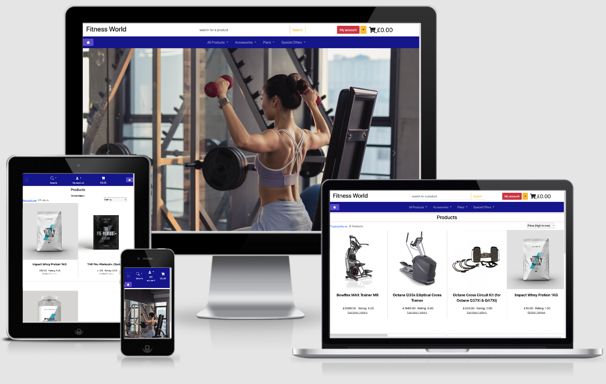

# Fitness World MS 4

 
This website is designded for the fitness and gym society, the potential customers are able to see the exercise plans and nutritions plans, at the same time are able to buy single items to improve the quality of exercise and results.

The idea was to design the website with the functionality quickly implement new products and exercise plans, nutritions plans, so any owner could manage the products not being skilled in web application development.

Hosted on [Heroku](https://fiteness-world-ms4.herokuapp.com/)
Repository on [GitHub](https://github.com/rimantascode/fitness-ms4)

## License

The project is shared for use with the [GNU General Public License v3](https://github.com/Pattern-Projects/oireachtas-ifd-project/blob/master/LICENSE)

This program is free software: you can redistribute it and/or modify
it under the terms of the GNU General Public License as published by
the Free Software Foundation, either version 3 of the License, or
(at your option) any later version.

# UX

## User Stories

User stories shaped my idea of how to create this project. 

- Owner Goals.
- As an admin, I want to sell exercise plans, nutrition plans, nutrition, and fitness related products to earn money.
- As an admin I want the customers to register so that I could keep the customers informed about the latest products.
- As an admin, I want to send emails about the latest products, so that will ensure returning customers.
- As admin I want the user to register, so they would only this way would be able to access the subscription content.
- As admin I want to add, edit, update, delete the products with a simple form. 

- User Goals
- As a user, I can see my purchased products in my profile, so I can keep track of my own records.
- As a user, I want to see the ratings of the products, which would help to choose the product. 
- As a user, I can sort the products by the ratings or price.
- As a user I want to buy single products, I need for the exercises.
- As a user I want to have a subscription, so that would let me to the full content of the site.
- As a user I want can see the product in detail, so that provides more information about the product.

## Design Process

1. **Strategy plane:** The main aim is to build an e-commerce website in which the customers would be able to join a fitness community, and purchase exercise plans and merchandise. What do I get in return? The income, If the customers will be registering I will be able to expand the customer's database and send the newsletter width varies offers.
2. **Scope plane:** Subscription-Based community, user profiles containing information that map to nutrition and/ or exercises plan.
 Product review. 
 Subscription-based payment model.
 Individual item purchase capability.
 Profiles for each customer.
 Are able to sort the products by price and ratings. 
 Authentication and authorization mechanism for subscribers and administrators. 
3. **Structure plane:** The main page will be representing what is the website about. The products will be displayed, and the customer will be able to click on the picture and the detailed information will be displayed with an opportunity to buy the item. If the customer will desire to see the exercise plans, then will be asked to buy the subscription, and once it will be activated, the exercise plans will be seen.
4. **Skeleton plane:** Once the structure plane was in place started to put it all together using Figma. In the first place, I thought to have a big picture in the home page, but later I decided to have a carousel. The grid of the products related to the fitness decided to have 4 per column on bigger screens and 2 large and medium, and one column on small screens. the cart can be accessed by clicking on the cart. The items in the cart displayed in the table and have the functionality to update and remove the items.
5. **Surface plane:** When I had the idea how the website will look like matched the colors, the most related to the fitness when I have done the research on what colors are used in the gym and fitness added those to my website.

**Conclusion** The website looks a bit different than in the mockup represented, that is because I find adding some thinks or the other make look more simpler and better. 

## Color Scheme

-  `black`
-  `#d40000`
-  `#ffc107 bootstrap warning`
-  `#000F9A`
-  `#dc3545 bootsrap danger`
-  `#6452d2`
-  `#0dcaf0 bootsrap info`
-  `#6c757d`

## Typography

sans-serif.

### Mockup

The website is a little bit different than in the mockup. Does not contain the about us and contact us pages as it is very simple, and the structure remained the same except the form and a text.

- [Mockup](https://www.figma.com/file/nLzb97S2rjPSuE9RAmZff3/Untitled?node-id=0%3A1)

## Features

Features planned, implemented, and outlined for later development.

### Planned Features

- Documentation - ReadMe File, Licence & Mockups.
- Colour Scheme.
- Login mechanism
- Responsive design - Mobile First.
- Authentication.
- Logo.
- UX elements.
- Git - Version Control System
- GitHub - Remote Repository
- Hosted - on Heroku
- Deployed - On Github. 
- Subscription - using stripe
- cart for merchandise items.
- Take payments - using stripe.
- The emails sent on purchase of any merchandise item.
- The confirmation letters sent once the customer register.
- Subscribed user access only exercise plans.
- Nutrition plans, not logged in user would be able to see 10 plans.
- Sell the items on the website related to fitness.
- Implement the form on the front end to add the products to the website.
- Implement a quick way to add exercise plans using the backend.
- Sort the products by categories, price alphabetically.
- Search the product in the store.
- On the home page the customer would be able to see the most popular and newest items.
- Checkout form validation.
- Messages displaying on the top of the page, telling what actions is doing the website. for example when the user logs in it tell the user that he is logged in. 
- Footer.
- Newsletter.

### Existing Features

- Documentation - ReadMe File, Licence & Mockups.
- Colour Scheme.
- Login mechanism.
- Responsive design - Mobile First.
- Authentication.
- Logo.
- UX elements.
- Git - Version Control System.
- GitHub - Remote Repository.
- Hosted - on Heroku.
- Deployed - On Github. 
- Subscription - using stripe.
- cart for merchandise items.
- Take payments - using stripe.
- The emails sent on purchase of any merchandise item.
- The confirmation letters sent once the customer register.
- Subscribed users access only the exercise plans.
- Sell the items on the website related to fitness.
- Implement the form on the front end to add the products to the website.
- Implement a quick way to add exercise plans using the backend.
- Sort the products by categories, price alphabetically.
- Search the product in the store.
- Checkout form validation.
- Messages displaying on the top of the page, telling what actions is doing the website. for example when the user logs in it tell the user that he is logged in. 

### Features Left to Implement/fix

- Nutrition plans, not logged in user would be able to see 10 plans.
- On the home page the customer would be able to see the most popular and newest items.
- Footer.
- Newsletter.1
- For some reason when resizing the window from 1200 the products become 3 in column, and it looks like it still could fit in, that has to be fixed

## Technologies Used.

- [HTML](https://developer.mozilla.org/en-US/docs/Web/HTML)
  - **HTML** for strucutre
- [CSS](https://developer.mozilla.org/en-US/docs/Web/CSS)
  - **CSS** for Styling
- [JavaScript](https://simple.wikipedia.org/wiki/JavaScript)
  - **JS** for creating dynamic functions, manipulating google places api.
- [jQuery](https://en.wikipedia.org/wiki/JQuery)
  - **jQuery** very useful for traversing and events handling
- [Google Chrome](https://www.google.com/chrome/)
  - Used for browsing and dev tools
- [Mozilla Firefox](https://www.mozilla.org/en-US/firefox/new)
  - Used for browsing and testing responsiveness.
- [Google](https://www.google.com/)
  - **Google** was used for research, work, and testing responsiveness
- [Gitpod](https://www.gitpod.io/)
  - **Git** used for Version Control
- [GitHub](https://github.com/)
  - Repository hosted on **GitHub**
- [Heroku](https://dashboard.heroku.com/apps)
  - Website hosted on **Github Pages**
- [Am I Responsive](http://ami.responsivedesign.is)
  - Testing responsiveness of the website **Am I Responsive**
- [AWS](https://aws.amazon.com/)
  - Used to store static files and media.
- [fontawsome](https://fontawesome.com/)
  - Used icons
- [bootstrap 5](https://getbootstrap.com/docs/5.0/getting-started/introduction/)
  - Used for styling and grid system.
- [Figma](https://www.figma.com/)
  - used to make a mockup
- All the libraries including the flask micro Framework have to be installed. All of them are listed in the requirements.txt, how to install please see the **Deployment** section.

## Manual Testing

In this section will be provided the testing process and results. Because this project consists of multiple apps, each paragraph represents the appropriate app.

### cart 

the JS code was tested using JSHint, with no major error. The functionality - update the quantity and remove the products from the cart. If you will use the arrows it will increase or decrease the amount and the links update and remove work and also the buttons KEEP SHOPPING and SECURE CHECKOUT takes to the appropriate destination. 
- [update-remove](source/update-remove.png)
views and context tested and with:
-[http://pep8online.com/](http://pep8online.com/) no errors found.
the HTML was tested width 
- [https://validator.w3.org/](https://validator.w3.org/) no errors found, except that it does not recognize the jinja template language.

### checkout
views, webhook_handler, webhooks, models, forms tested with:
- [http://pep8online.com/](http://pep8online.com/) - no major problems found except some lines are slight to long.

The HTML files in templates folder tested with:
- [https://validator.w3.org/](https://validator.w3.org/) - 
no major problems found except that jinja templating courses and error.

stripe_elements.js tested with:
- [https://jshint.com/](https://jshint.com/) - no major found just 2 warnings "'template literal syntax' is only available in ES6 (use 'esversion: 6')."

Testing form validation:
- [form-validation](source/form-validation.jpg)

The checkout:
- [form-before-submition](source/form-before-submition.png)
- [stripe-webhook](source/stripe-webhook.png)
- [email-confirmation](source/email.png)

### home

index html tested with:
- [https://validator.w3.org/](https://validator.w3.org/) - no major problems found, except that it does not understand jinja templating.

view tested width:
- [http://pep8online.com/](http://pep8online.com/)  - no major problems found. 

### products 
forms, models, views, admin validated with:

- [http://pep8online.com/](http://pep8online.com/) - no major problems except some lines are slightly too long.

the templates tested with
- [https://validator.w3.org/](https://validator.w3.org/) - no major problems except jinja templating is not recognized.

JavaScript tested with:
- [https://jshint.com/](https://jshint.com/) no major problems found.

Manually tested the functionality. Products are displayed and can be arranged by Price and rating using the top navigation or the select box. All buttons work. edit and delete buttons can be seen only by the admin. 

- [edit-delete-products](source/edit-delete-products.png)
- [edit-delete-product-details](source/edit-delete-products.png)

- [no-buttons](source/no-buttons.png)
- [no-buttons-2](source/no-buttons-2.png)

### profiles

forms, models, views tested with:
- [http://pep8online.com/](http://pep8online.com/) - no major problems found.

the templates tested with
- [https://validator.w3.org/](https://validator.w3.org/) - no major problems except jinja templating is not recognized.

JavaScript tested with:
- [https://jshint.com/](https://jshint.com/) no major problems found.

The functionality tested manually, it works and updates the information.

### subscription_plans 

admin, models, views tested with:
- [http://pep8online.com/](http://pep8online.com/) - no major problems found, except some lines are slightly too long.

The HTML files in the templates folder tested with:
- [https://validator.w3.org/](https://validator.w3.org/) - 
no major problems found except that jinja templating courses and error.

### base.html 

base HTML validate not major error found. bases.html includes two navigations one for a bigger screen and the other for smaller screens.
### CSS Validation

To validate my CSS code I used [https://validator.w3.org/](https://validator.w3.org/) 

### Testing on Browsers

Tested on Google Chrome, Opera, Mozilla firefox. No issues.

### Testing on Devices

Used Google Chrome, Opera, Mozilla Firefox browser to test the responsiveness, for all sizes looks satisfying, but on Galaxy fold does not look, it has to be looked into it.

## Deployment locally

The process involved:

- In this project, you have to use the Code institute template [here](https://github.com/Code-Institute-Org/gitpod-full-template).
- Click the green button "use this template".
- How to create a new repository [here](https://docs.github.com/en/enterprise/2.15/user/articles/create-a-repo) , but in this case enter the title of the project, the description, choose privet or public and click create a repository from the template. 
- On the GitHub repository settings page move to the GitHub Pages section.
- Change source to master branch. (Or any desired branch).
- Once the workspace is ready:
- In the terminal, in your root directory.
- Type 'git clone ' followed by the code taken from the GitHub repository.
- `git@github.com:rimantascode/fitness-ms4.git`
- for example `git clone git@github.com:rimantascode/fitness-ms4.git` 
- Install requirements.txt by typing in the terminal 
- `pip3 install -r requirements.txt`
- In this cloned version the pictures might not be the best quality. But you can easily add a new product by using your own pictures, it is advisable to use the same size pictures for the best look.
- create an environment variable in GitPod settings.
- You have to will have to register to stripe and retrieve the keys.
- Also create the product in the stripe and retrieve the Price ID. 
- SECRET_KEY, STRIPE_PUBLIC_KEY, STRIPE_SECRET_KEY, STRIPE_SUB_WEBHOOK(this is for subscription webhook, secret key),
- DEVELOPMENT set to True.
- run the command line in the terminal 
- `python3 manage.py runserver`
- ready to use!!!

## Deploy to Heroku
- You will need to create s3 bucket in [AWS](https://aws.amazon.com)
- Configure Bucket Cors and Policy.
- You have to create profile using IAM and give the user full access to the Bucket.
- create "media" folder and uploud the pictures, or if you will be adding them manualy they will be saved there.
- Static files will be collected automatically on deployment to Heroku, but before deploying the first time run `heroku config:add DISABLE_COLLECTSTATIC=1`
in the terminal before deployment to heroku.
- You have to create a new app in [Heroku](https://dashboard.heroku.com/new-app)
- give a unique name and choose a region to Europe.
- a gave the name of the app "testing-deployment" for testing porpuse, or any other dired name. 
- Create Postgres database in Resources. It is free version.
- Click on Settings, and then the button "Reveal Config Vars".
- 
- AWS_ACCESS_KEY_ID - Your unique
- AWS_SECRET_ACCESS_KEY your unique
- DATABASE_URL - this will be when you will create the database.
- DOMAIN_URL - Your heroku app url 
- EMAIL_HOST_PASS - recommended to use google service to send emails.
- EMAIL_HOST_USER - recommended to use google service to send emails.
- SECRET_KEY - Generate online one.
- STRIPE_PUBLIC_KEY - Get it from stripe.
- STRIPE_SECRET_KEY - Get it from stripe. 
- STRIPE_SUB_WEBHOOK - Get it from stripe, but first create webhook pointend.
- STRIPE_WH_SECRET - Get from the stripe this a webhook pointed key to bay single items.
- USE_AWS it has to be set to "True". 
- `heroku login -i` , and enter the credentials.
- In the terminal, go to deploy section you will see the line similar to this.
- `heroku git:remote -a testing-deploymenta`
- create requirements.txt
- `pip3 freeze > requirements.txt`
- create Prockfile with a capital "P" this is a requirement, and this is what you add in to it `web: gunicorn fitness_ms4.wsgi:application`
- In settings.py add the heroku app address to ALLOWED_HOSTS.
In settings.py add the correct values to AWS_STORAGE_BUCKET_NAME and AWS_S3_REGION_NAME.
- and then `git add . ` and `git commit -m"added requirements.txt and Prock files" `
- `git push heroku master`
- once it has been pushed, in the terminal.
- ready to use.
- ` heroku open`

## Credits
- Thank you.
- [used-products-pictures-for-learning-porpuses]{https://www.myprotein.com/sports-nutrition/pure-caffeine-tablets/10529801.html)
- Thank you.
- [used-products-pictures-for-learning-porpuses](https://www.fitness-superstore.co.uk/body-power-15mm-floor-tile-ramp-edge.html)
Thank you.
- [photo](https://www.flickr.com/photos/dennis/102679650
https://live.staticflickr.com/32/102679650_cd10235c8f_k_d.jpg) for very nice picture.)
- Thank You
- [picture](https://www.pexels.com/photo/photo-of-woman-raising-dumbbells-2475878)
- [picture](https://www.pexels.com/photo/balance-body-exercise-female-374101/)
- [picture](https://www.pexels.com/photo/yoga-instructor-helping-a-student-3822719/)

### Acknowledgements

Thank you inspiration, very usefull guidence and tips:
- Precious_Mentor
- Code Institute
